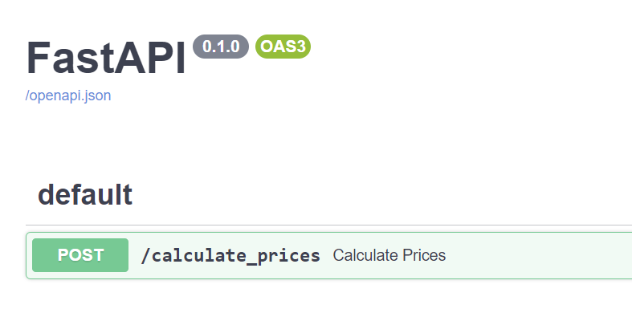

# Python DDD Example and Techniques (Franchise Prices)

*NOTE: This repository is an example to explain 'how to implement DDD architecture on a Python web application'. If you will to use this as a reference, add your implementation of authentication and security before deploying to the real world!!*

## Tech Stack

* [FastAPI](https://fastapi.tiangolo.com/)
* [SQLAlchemy](https://www.sqlalchemy.org/)
  * [SQLite](https://www.sqlite.org/index.html)
* [Poetry](https://python-poetry.org/)
* [Docker](https://www.docker.com/)

## Code Architecture

Directory structure (based on [Onion Architecture](https://jeffreypalermo.com/2008/07/the-onion-architecture-part-1/)):

```tree
├── main.py
├── dddpy
│   ├── domain
|   |   ├── plan
│   │   └── price
│   ├── infrastructure
|   |   ├── seed.py
│   │   └── sqlite
|   |       ├── plan
│   │       ├── price
│   │       └── database.py
│   ├── presentation
│   │   └── schema
│   │       └── plan
│   └── usecase
│       └── price
└── tests
```

### The main responsability of this application is to provide an endpoint to calculate franchise prices.

*All the plans and prices are fixed.*

* [seed.py](./dddpy/infrastructure/seed.py)

Prices:

code area from | code area to | $/min 
--- | --- | --- 
011 | 016 | 1.90
011 | 016 | 2.90
011 | 016 | 1.70
011 | 016 | 2.70
011 | 016 | 0.90
011 | 016 | 1.90 

Plans:

descripton | franchise | percentage to increase
--- | --- | --- 
FaleMais 30 | 30 | 10%
FaleMais 60 | 60 | 10%
FaleMais 120 | 120 | 10%

## How to work

## For devs:
1. Clone and open this repository using VSCode
2. Run Remote-Container
3. Run `make dev` on the Docker container terminal
4. Access the API document http://127.0.0.1:8000/docs
5. Alternatively you can run unit test with the command `make test`

## For use:
1. Clone and open this repository
2. Run docker-compose up -d
3. Access the API document http://127.0.0.1:8000/docs

#



### Sample requests for the RESTFul API

* Calculate a price:

```bash
curl --location --request POST 'localhost:8000/calculate_prices' \
--header 'Content-Type: application/json' \
--data-raw '{
  "code_area_from": "011",
  "code_area_to": "016",
  "minutes": 20,
  "plan_description": "FaleMais 30"
}'
```

* Response of the POST request:

```json
{
  "code_area_from": "011",
  "code_area_to": "016",
  "minutes": 20,
  "plan_description": "FaleMais 30",
  "value_with_franchise": "$ 0.00",
  "value_without_franchise": "$ 38.00"
}
```
